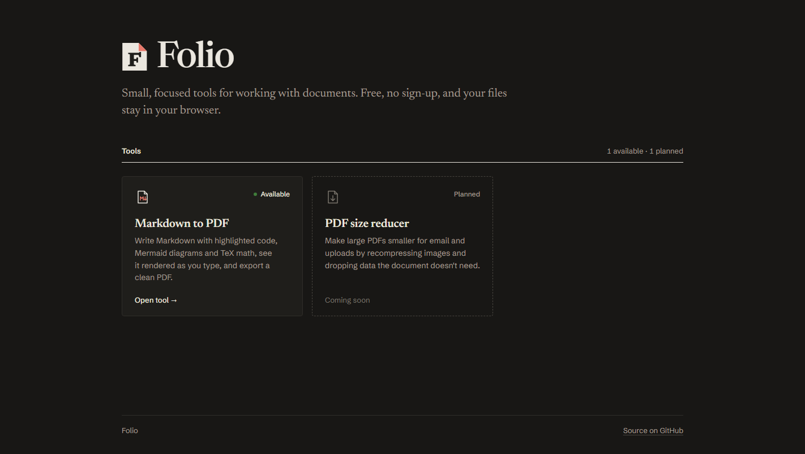
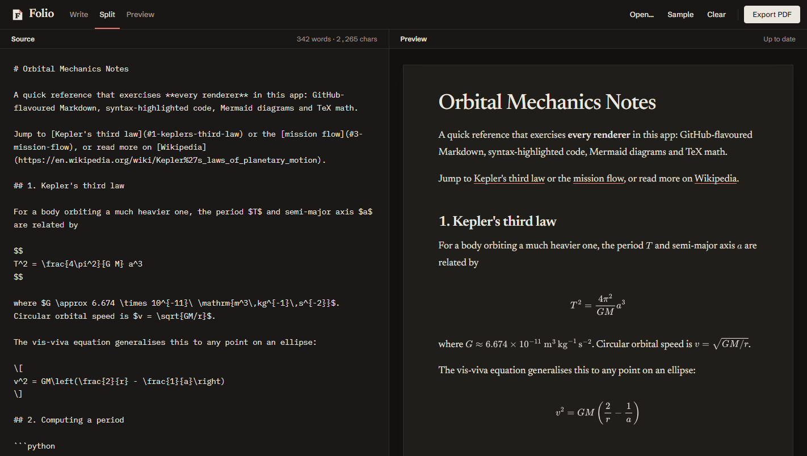
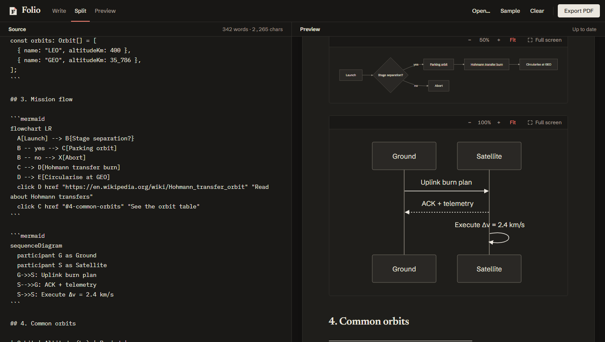

# Folio

Small, focused tools for working with documents. Each tool is a single HTML file that runs in the browser.

| Tool | File | Status |
|------|------|--------|
| Markdown to PDF | `markdown-to-pdf.html` | Available |
| PDF size reducer | — | Planned |

**Live:** https://sachinmehan3.github.io/folio-markdown/

`index.html` is the home page that links to each tool.

## Markdown to PDF

A live Markdown renderer with syntax-highlighted code, Mermaid diagrams and TeX math. Open `markdown-to-pdf.html` in a browser. Type on the left, see the result on the right. Needs an internet connection to load its libraries from a CDN.

### Features

- **Math:** `$inline$`, `$$display$$`, `\(…\)`, `\[…\]`, or a `math` code block
- **Diagrams:** Interactive `mermaid` code blocks with zoom (− / + / Fit / 100%) and full-screen viewer
- **File handling:** Open or drag in a `.md` file; drafts auto-save to browser local storage
- **Views:** Switch seamlessly between Write, Split, and Preview modes
- **Export PDF:** Opens the print dialog formatted cleanly for "Save as PDF"

Built with marked, highlight.js, Mermaid, MathJax and DOMPurify.
